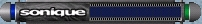



## How To Shape Forms by Scanning Bitmaps

### Description

This shows how to scan a bitmap and create a shape for your form by taking out the background color or a color you specify.
 
### More Info
 

             |
---                |---
**Submitted On**   |2002-08-06 13:39:40
**By**             |[Brian Yule](https://github.com/Planet-Source-Code/PSCIndex/blob/master/ByAuthor/brian-yule.md)
**Level**          |Advanced
**User Rating**    |5.0 (10 globes from 2 users)
**Compatibility**  |VB 6\.0
**Category**       |[Graphics](https://github.com/Planet-Source-Code/PSCIndex/blob/master/ByCategory/graphics__1-46.md)
**World**          |[Visual Basic](https://github.com/Planet-Source-Code/PSCIndex/blob/master/ByWorld/visual-basic.md)
**Archive File**   |[How\_To\_Sha1244968302002\.zip](https://github.com/Planet-Source-Code/brian-yule-how-to-shape-forms-by-scanning-bitmaps__1-38367/archive/master.zip)

